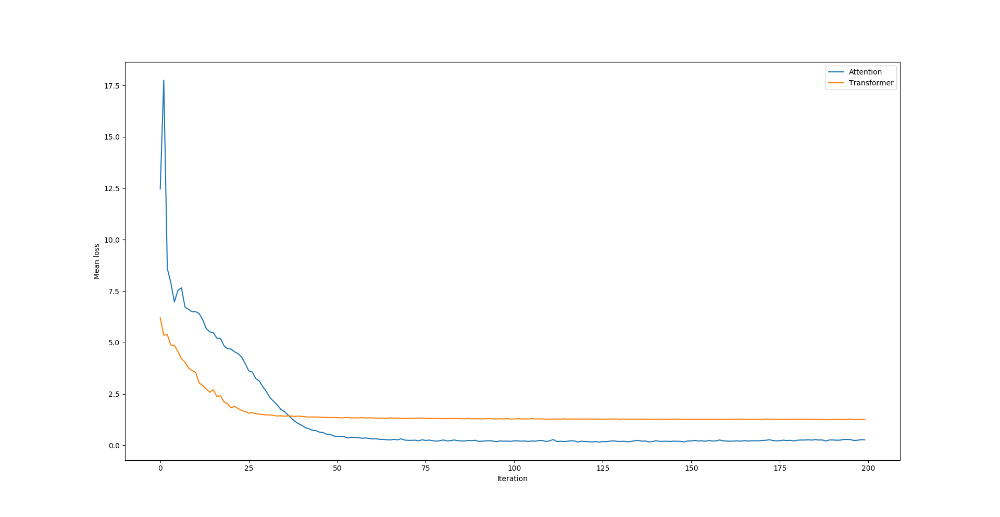
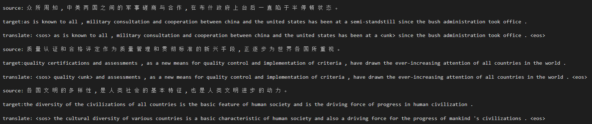
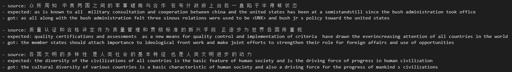

# Attention-Transformer
Machine Translation（cn2en)
This project is to reliazed the Machine Translation task based on [Attention mechainism](https://arxiv.org/abs/1409.0473) and [Transformer](https://arxiv.org/pdf/1706.03762.pdf). Considering the preformance of machine, we only select 6834 cn-en parallel corpora(6800s testing samples and 34s testing samples) to analysis the convergence of models and do not comprase the Blue score.

## Enviroment Requirements
The model must be run on Python >= 3.5 and Tensorflow >= 1.10 (one-point-ten).

## Hyper-parameters setting

### Attention mechanism

- SRC_TRAIN_DATA = train_cn_path  # The path of source lanuage.
- TRG_TRAIN_DATA = train_en_path  # The path of target lanuage.
- CHECKPOINT_PATH = checkpoint_path  # The saving path of checkpoint。
- HIDDEN_SIZE = 1024  # LSTM hidden-layer
- DECODER_LAYERS = 2  # The LSTM layer number of Decoder, Encoder use one-way LSTM.
- SRC_VOCAB_SIZE = 4000  # The vocab of source language.
- TRG_VOCAB_SIZE = 10000  # The vocab of target language.
- BATCH_SIZE = 100  # Batch num.
- NUM_EPOCH = 200  # Iteration number.
- KEEP_PROB = 0.8  # 
- MAX_GRAD_NORM = 5  # The upper limit of gradient expansion.
- SHARE_EMB_AND_SOFTMAX = True  # Sharing parameters between softmax and embedding, if true.
f- MAX_LEN = 50  # The maximum number of words in each setences.
- SOS_ID = 1  # <sos> ID of target vocab.

### Transformer
- batch_size = 32  # alias = N
- lr = 0.0001  # learning rate. In paper, learning rate is adjusted to the global step.
- logdir = path_log   # log directory
- maxlen = 50  # Maximum number of words in a sentence. alias = T.
- min_cnt = 2  # words whose occurred less than min_cnt are encoded as <UNK>.
- hidden_units = 512  # alias = C
- num_blocks = 6  # number of encoder/decoder blocks
- num_epochs = 200
- num_heads = 8
- dropout_rate = 0.1  # the rate you want to drop out.
- sinusoid = False  # If True, use sinusoid. If false, positional embedding.

## Results analysis

 
Figure 1. mean loss

From Figure 1. we can clearly see that comparing Attention, Transformer has converged after about 30 epochs, and the curve is smoother. In the experiment the traning time of Transformer is lesser (The motivation of Transformer is to overcome the shortage that Attention model is hard to parallel computation and need a long traning time). In this Figure, through the Attention loss is smaller than Transformer, but is contrary in actual situtation (more data).

We can also comparise the translation results of Attention and Transformer:

 
Figure 2. Attention translation

 
Figure 3. Transformer translation

More introduction about machine translation (Attention Mechanism and Transformer, etc.) please read my Notebook [Machine Translation](https://zhuanlan.zhihu.com/p/50915723), [Transformer](https://zhuanlan.zhihu.com/p/52242109).

